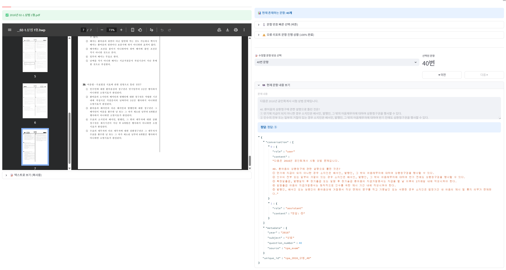

# CPA 데이터셋 수정 도구

공인회계사(CPA) 시험 기출문항 JSONL 데이터를 **열람·편집·검증**하는 Streamlit 기반 웹 도구입니다.

---

## 주요 기능

| 기능 | 설명 |
|------|------|
| **문항 편집** | 연도·과목별로 문항을 선택해 JSON을 직접 수정·저장 |
| **신규 문항 추가** | Gemini 등으로 추출한 JSONL을 붙여넣어 일괄 추가 |
| **정답표 vs 데이터 일치 확인** | 정답표를 붙여넣거나 표에서 직접 입력해 실제 정답과 한눈에 비교·수정 |
| **PDF 원문 뷰어** | 문제 PDF, 정답 PDF를 앱 안에서 바로 확인 |
| **JSONL 다운로드** | 선택한 연도·과목만 JSONL 파일로 내려받기 |
| **오류 리포트(선택)** | 누락 문항 목록을 메모해 필요 시 확인 |
| **자동 백업** | 저장 시 `backups/` 폴더에 타임스탬프 백업 자동 생성 |

---

## 앱 미리보기

아래는 실제 앱 화면 예시입니다. 연도·과목별 문항 편집, 정답 비교, PDF 뷰어 등을 한 화면에서 직관적으로 사용할 수 있습니다.



---

## 폴더 구조

```
CPA_datasets/
├── app.py                              # Streamlit 앱 (진입점)
├── cpa_2016_2025_combined.jsonl        # 메인 데이터 (2016~2025 기출)
├── cpa_2012_2015.jsonl                 # 보조 데이터 (2012~2015 기출)
├── data/
│   ├── raw_pdfs/                       # 연도별 문제·정답 PDF (아래 구조 참고)
│   ├── error_report.md                 # 누락·오류 문항 리포트
│   ├── manual_check_status.json        # 누락 문항 수동 확인 상태
│   └── uploads/                        # PDF 직접 업로드 임시 폴더
├── backups/                            # 자동 백업 (저장 시 생성)
└── README.md
```

- **`DATA_FILE`** (기본값: `cpa_2016_2025_combined.jsonl`)  
  앱이 읽고 쓰는 메인 JSONL 파일입니다. `app.py` 상단에서 변경할 수 있습니다.

---

## 검수 워크플로

- 연도별 담당자가 **모든 문항을 원문 PDF와 1:1 대조**하여 전수 확인합니다.
- 1차 완료 후 **서로 교차검증**하여 다시 확인합니다.
- `error_report.md`에 의존하지 않으며, **문항 내부 오탈자/누락까지 전부 확인**합니다.
- 수정 사항은 JSONL에 직접 반영합니다.

## 자주 발생하는 OCR 오류

- 부호 누락/반전 (예: `-5,000` → `5,000`)
- 선택지 조합 표기 오류 (예: `ㄱ`, `ㄱㄴ`, `ㄴㄷ` 등)
- 표/도표 값 누락 또는 줄맞춤 깨짐
- 단위/기호 누락 (예: `₩`, `%`, 괄호)

---

## data/ 디렉터리 상세

### data/error_report.md — 오류 리포트

연도·과목별로 누락되거나 문제가 있는 문항을 기록한 파일입니다.  
앱의 **「📋 오류 리포트 전체보기」** 탭과 사이드바 **「⚠️ 누락된 문항 정보」** 에서 읽어 표시합니다.

현재는 전수 검수 방식으로 운영하므로 **`error_report.md` 작성은 선택 사항**입니다.

작성 형식:

```markdown
[ ✅ 2024년 ]
📌 경제원론
- 6번 문항이 아예 추출되지 않음
- 8~10번 문항이 아예 추출되지 않음

📌 경영학
- 31번 문항 '㈜ -> 주'로 표기됨
```

| 항목 | 설명 |
|------|------|
| `[ ✅ {연도}년 ]` | 연도 헤더 |
| `📌 {과목}` | 과목 헤더 |
| `- {설명}` | 해당 문항의 문제 상황 |

### data/manual_check_status.json — 수동 확인 상태

`error_report.md`에 기재된 누락 문항을 **앱에서 완료 체크**하면 이 파일에 기록됩니다.

```json
{
  "checked_questions": {
    "2016_경제원론_21": true,
    "2024_경제원론_6": true
  }
}
```

- 키 형식: `{연도}_{과목}_{문항번호}`
- 값: `true` = 확인 완료
- 앱 사이드바에서 체크/체크 해제하면 자동 저장됩니다.

---

## data/raw_pdfs/ — PDF 파일 구조

앱이 **문제 PDF**, **정답 PDF**를 자동으로 찾을 수 있도록, 아래 폴더 규칙에 맞춰 넣어야 합니다.

### 폴더 이름 규칙

```
data/raw_pdfs/
├── 00년 공인회계사 제1차 문제 및 답안/
├── 01년 공인회계사 제1차 문제 및 답안/
│   ...
├── 16년 공인회계사 제1차 문제 및 답안/
├── 24년 공인회계사 제1차 문제 및 답안/
└── 25년 공인회계사 1차 문제 및 가답안/
```

- 폴더명은 **2자리 연도**로 시작하면 됩니다 (예: `16년`, `24년`).
- 뒤에 어떤 텍스트가 와도 상관없습니다 (`제1차 문제 및 답안` 등).
- 앱은 `{2자리연도}년*` 패턴으로 폴더를 검색합니다.

### 문제 PDF 파일 이름 규칙

폴더 안에 **과목명**이 포함된 PDF를 넣으면 앱이 자동으로 찾습니다:

```
16년 공인회계사 제1차 문제 및 답안/
├── 2016년 01-1.경영학 1형.pdf          ← 과목명 "경영학" 포함
├── 2016년 01-2.경제원론 1형.pdf        ← "경제원론" 포함
├── 2016년 02-1.상법 1형.pdf            ← "상법" 포함
├── 2016년 02-2.세법 1형.pdf            ← "세법" 포함
├── 2016년 03-1.회계학 1형.pdf          ← "회계학" 포함
└── 2016년 00.전체정답(확정정답).pdf     ← 정답 PDF
```

- 파일명에 선택한 **과목명**(경영학, 경제원론, 상법, 세법, 회계학 등)이 들어 있으면 매칭됩니다.
- 파일명에 "정답", "답안" 등이 포함된 파일은 **문제 PDF 검색에서 제외**됩니다.

### 정답 PDF 파일 이름 규칙

정답 PDF는 **연도 폴더 전체**에서 하나만 검색됩니다 (과목 무관):

```
키워드 우선순위: 확정정답 > 전체정답 > 최종정답 > 정답 > 답안 > 가답안
```

예시:
- `2016년 00.전체정답(확정정답).pdf` → "확정정답" 매칭
- `2022년 정답.pdf` → "정답" 매칭
- `2025년_가답안.pdf` → "가답안" 매칭

### 정리: 새 연도 추가 시

1. `data/raw_pdfs/` 아래에 **`{2자리연도}년 ...`** 폴더 생성
2. 과목별 문제 PDF 넣기 (파일명에 과목명 포함)
3. 정답 PDF 넣기 (파일명에 "정답" 또는 "답안" 포함)
4. 앱에서 해당 연도·과목 선택하면 자동 인식됩니다

---

## 설치 및 실행

### 1. 의존성 설치

```bash
pip install streamlit pandas pdfplumber
```

### 2. 실행

```bash
cd CPA_datasets
streamlit run app.py
```

브라우저에서 `http://localhost:8501` 로 접속합니다.

### 3. 데이터 파일 변경 (선택)

다른 JSONL 파일을 사용하려면 `app.py` 상단의 `DATA_FILE`을 수정하세요:

```python
DATA_FILE = "cpa_2012_2015.jsonl"   # 2012~2015 데이터로 변경
```

---

## 사용법

### 연도·과목 선택

1. 왼쪽 사이드바에서 **연도**와 **과목**을 선택합니다.
2. 해당 연도·과목의 문항 수가 표시됩니다.
3. 사이드바 하단의 **「📄 JSONL」** 버튼으로 해당 부분만 다운로드할 수 있습니다.

### 문항 편집

1. **「📝 기존 문항 수정」** 탭에서 문항 번호를 선택합니다.
2. JSON 편집기에서 내용을 수정한 뒤 **「💾 저장」** 을 누릅니다.
3. 저장 시 자동으로 백업이 생성됩니다.

### 신규 문항 추가

1. **「➕ 신규 문항 추가」** 탭에서 JSONL 텍스트를 붙여넣습니다.
2. 파싱 결과를 확인하고 **일괄 추가** 또는 **덮어쓰기** 버튼을 누릅니다.

### 정답표 확인·수정

1. **「📋 정답표 vs 데이터 일치」** 탭으로 이동합니다.
2. 정답표를 붙여넣거나(예: `1 ①`, `2 ②`) 비교 표에서 직접 입력합니다.
3. **「💾 편집한 정답표로 반영 후 저장」** 을 누르면 데이터에 반영됩니다.

### PDF 원문 확인

- 왼쪽 **문제** / **정답** 탭에서 PDF를 바로 볼 수 있습니다.
- PDF가 자동 검색되지 않으면 사이드바 **⚙️ PDF 설정**에서 직접 업로드합니다.

---

## 데이터 형식 (JSONL)

한 줄에 하나의 JSON 객체:

```json
{
  "conversation": [
    {"role": "user", "content": "다음은 2024년 공인회계사 시험 경제원론 문제입니다.\n\n1. ..."},
    {"role": "assistant", "content": "정답: ①"}
  ],
  "metadata": {
    "year": "2024",
    "subject": "경제원론",
    "question_number": 1,
    "source": "cpa_exam"
  },
  "unique_id": "cpa_2024_경제원론_1"
}
```

| 필드 | 설명 |
|------|------|
| `conversation` | `[user(문제), assistant(정답)]` 최소 2개 메시지 |
| `metadata.year` | 시험 연도 (문자열) |
| `metadata.subject` | 과목명 (경영학, 경제원론, 회계학, 세법, 상법 등) |
| `metadata.question_number` | 문항 번호 (정수) |
| `unique_id` | `cpa_{연도}_{과목}_{번호}` 형식의 고유 ID |
